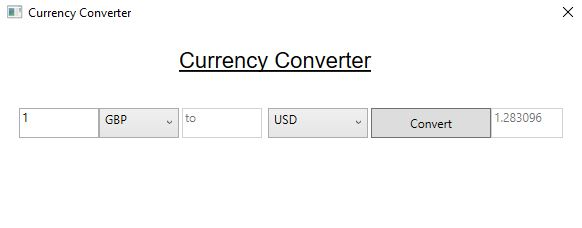

# CurrencyWPF

A currency program written in C#.NET/WPF.

Program info:
It will retrieve a json string from a URL and converts it to Currency objects, 
allows you to enter the amount you wish to convert from one currency to another.

## Main program

